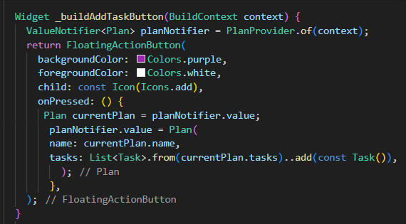
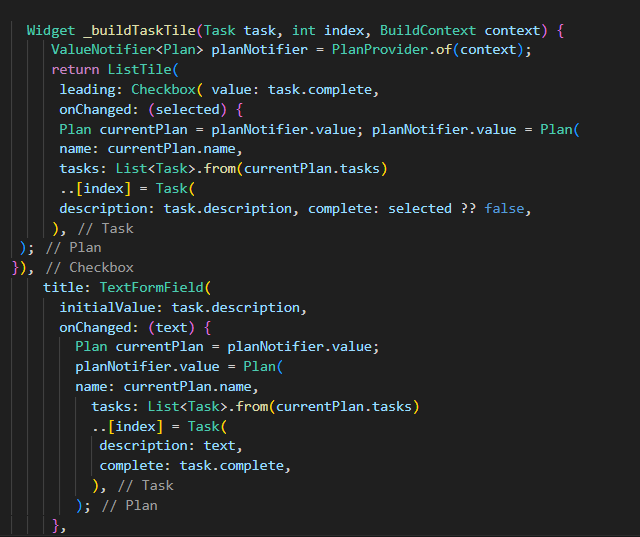
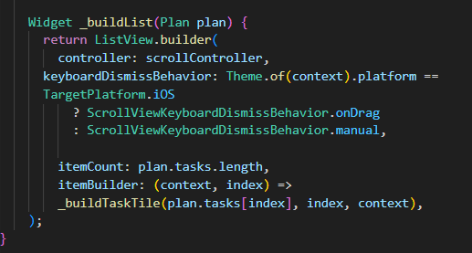
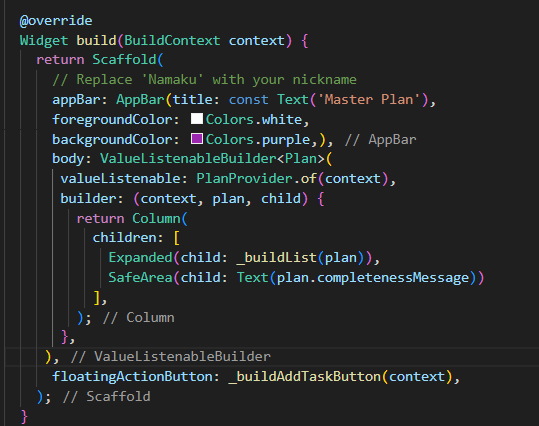
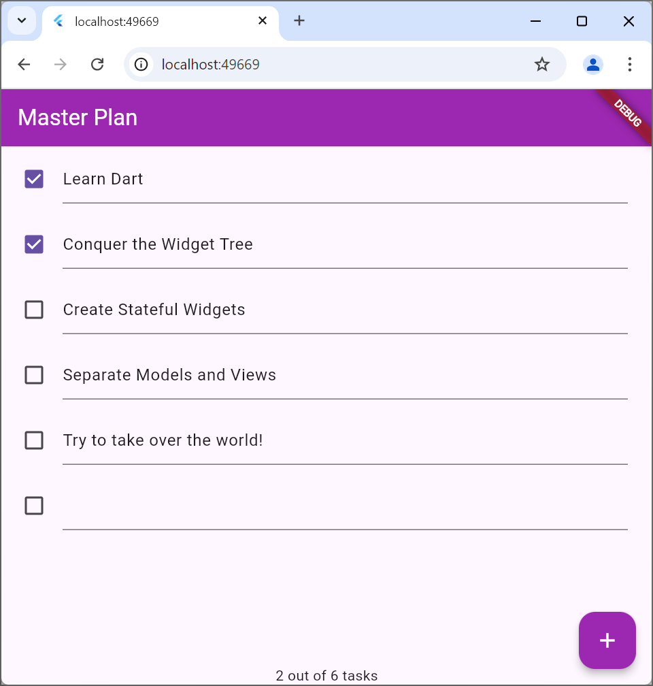
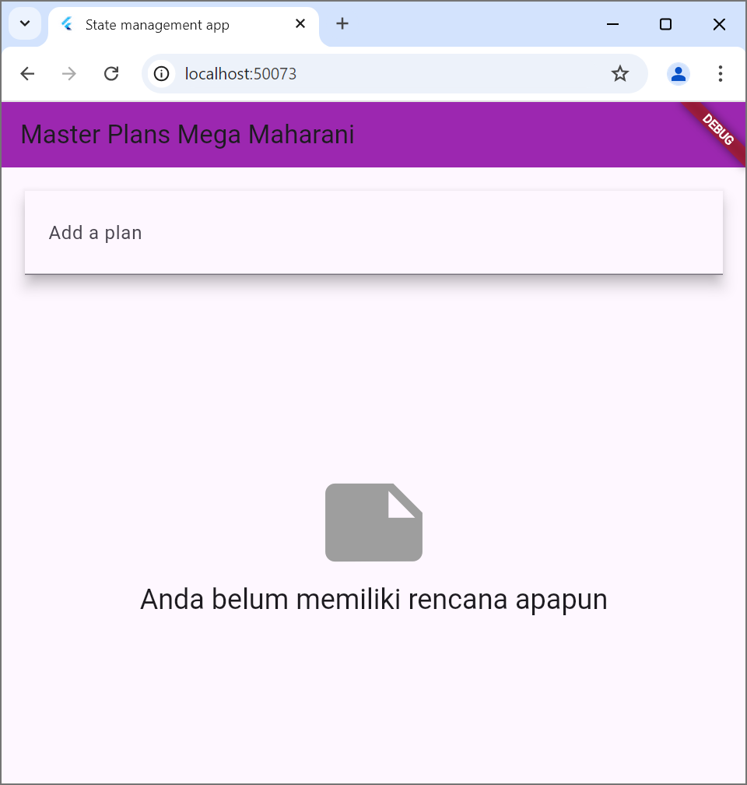
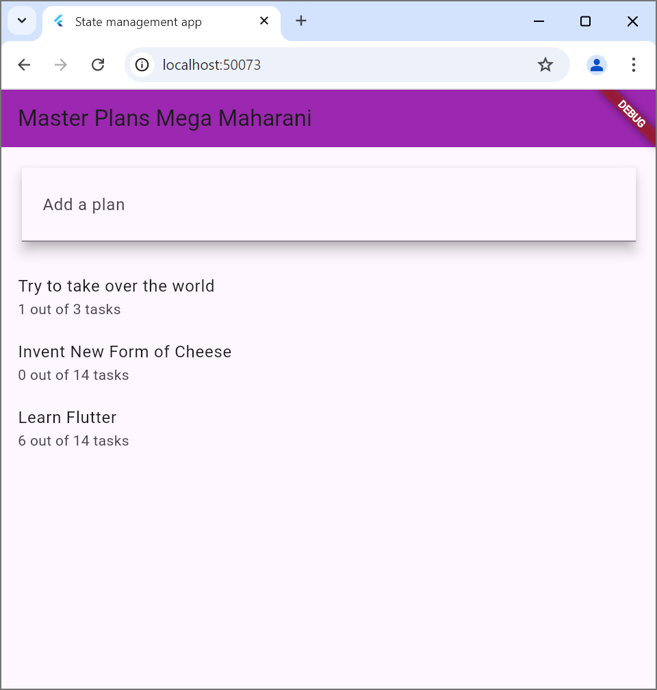

Praktikum 1: Dasar State dengan Model-View

Langkah 1: buat project flutter dengan nama master_plan selanjutnya tambahkan folder models dan views di dalam lib.
langkah 2: Membuat model task.dart di dalam folder models.
langkah 3: Membuat file plan.dart di dalam folder models.
langkah 4: Membuat file data_layer.dart di dalam folder models.
langkah 5: Rubah isi kode main.dart
Langkah 6: Membuat file plan_screen.dart di dalam folder views.
langkah 7: Membuat method _buildAddTaskbutton di dalam class PlanScreenState
Langkah 8: Membuat widget _buildList 
Langkah 9: Membuat widget _buildTaskTile

Langkah 10: Tambahkan variabel scroll controller di dalam file plan_screen.dart

Langkah 11: Tambahkan method initState() setelah scrollController.

Langkah 12: Tambahkan controller dan keyboard behavior 

Langkah 13: Tambahkan method dispose()
Hasil: 

Tugas Praktikum:
2.Jelaskan maksud dari langkah 4 pada praktikum tersebut! Mengapa dilakukan demikian?
Jawab: praktikum langkah 4 untuk menyederhanakan proses pengolaan dan pengimporan seluruh model tersebut hanya dengan satu pernyataan. Hal ini dilakukan karena untuk memudahkan pengimporan tanpa harus mengimpor setiap model satu per satu.
3.Mengapa perlu variabel plan di langkah 6 pada praktikum tersebut? Mengapa dibuat konstanta ?
4.Lakukan capture hasil dari Langkah 9, kemudian jelaskan apa yang telah Anda buat!
5.Apa kegunaan method pada Langkah 11 dan 13 dalam lifecyle state ?

Praktikum 2: Mengelola Data Layer dengan InheritedWidget dan InheritedNotifier

Langkah 1: Membuat file plan_provider.dart di dalam folder provider
Langkah 2: Rubah main dart bagian home menjadi planprovider dan import.

Langkah 3: Tambahkan method di dalam model class plan.dart

Langkah 4: Edit Planscreen dengan menggunakan data dari PlanProvider.
Langkah 5: Edit method _buildAddTaskButton, tambahkan buildcontext dan gunakan planprovider sebagai sumbernya.

Langkah 6: Edit method _buildTaskTile menjadi TextFormField.

Langkah 7: Edit _buildList 

Langkah 8: Tambahkan widget SafeArea 

Hasil:

Tugas Praktikum:
2.Jelaskan mana yang dimaksud InheritedWidget pada langkah tersebut! Mengapa yang digunakan InheritedNotifier?
3.Jelaskan maksud dari method di langkah 3 pada praktikum tersebut! Mengapa dilakukan demikian?
4.Lakukan capture hasil dari Langkah 9, kemudian jelaskan apa yang telah Anda buat!

Praktikum 3: Membuat State di Multiple Scieens
Langkah 1: Mengedit PlanProvider
Langkah 2: Mengedit main.dart 
Langkah 3: Lalu edit plan_screen.dart
Hasil:

